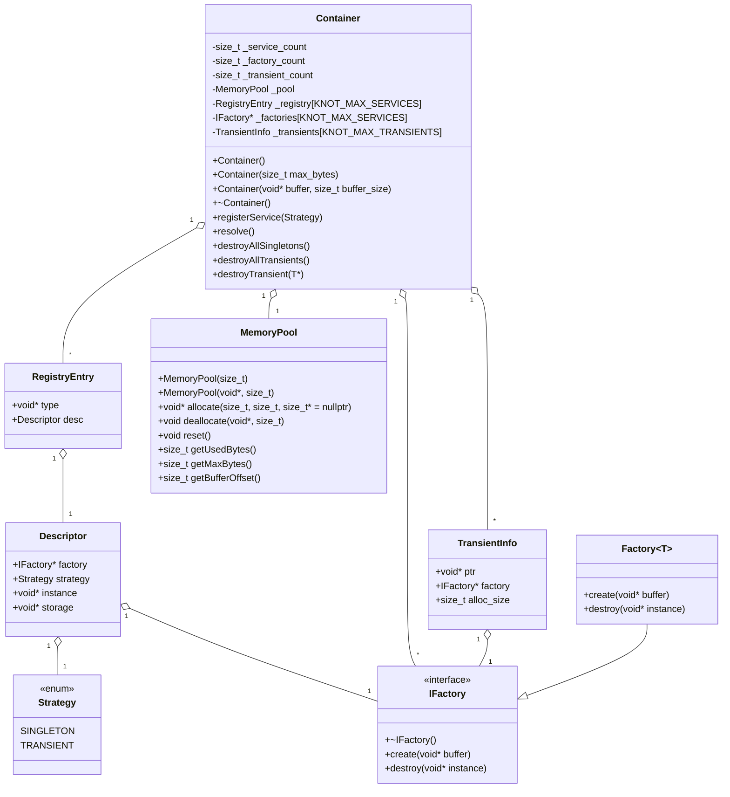

# Knot-DI

Библиотека для инъекции зависимостей на C++ нацеленная на встраиваемые системы

## Возможности

- Регистрация и разрешение зависимостей по типу
- Поддержка singleton и transient сервисов
- Простое API для внедрения зависимостей в классы
- Минимальные внешние зависимости
- Контроль памяти

## Пример использования

```cpp
Container container;

container.register<IMyService>();
container.register<IRepository>(TRANSIENT, "repository");

IMyService *service = container.resolve<IMyService>();
IMyRepository *repository = container.resolve<IRepository>();

```

## Диаграмма классов


