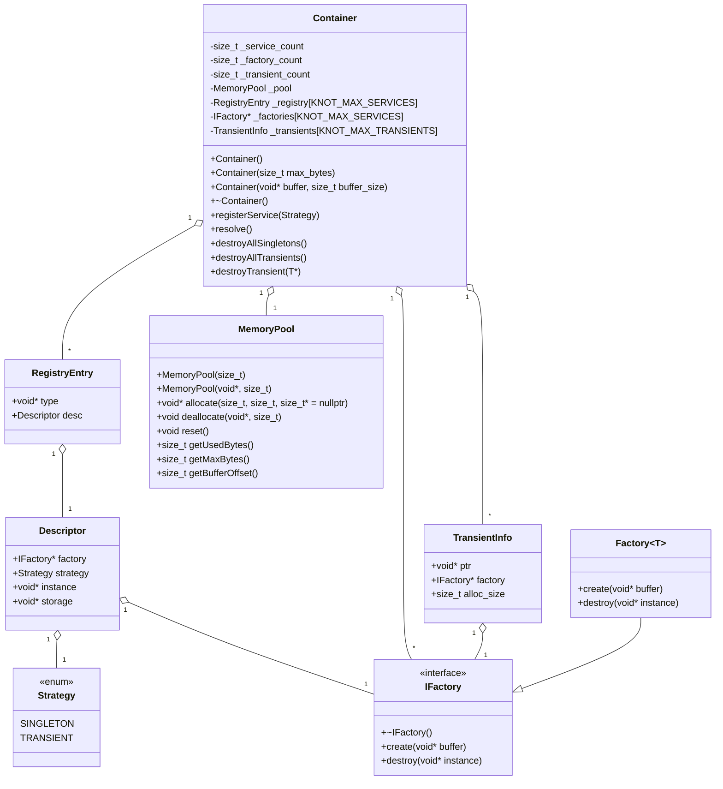

# Knot-DI

**Knot-DI** - это библиотека для внедрения зависимостей на C++03, ориентированная на встраиваемые, устаревшие или ресурсоограниченные среды, где современные возможности C++ недоступны.

## Возможности

- Только заголовочные файлы: не требует линковки, просто подключите заголовки.
- Совместимость с C++03: работает на старых компиляторах.
- Поддержка жизненных циклов Singleton и Transient
- Пользовательский пул памяти
- Макросы для регистрации сервисов с разным количеством конструкторов

## Ограничения

- Требуется компилятор с поддержкой C++03 (например, GCC, Clang)
- CMake ≥ 3.10
- [Опционально] lcov/genhtml для покрытия, clang-format для форматирования, Doxygen для документации

## Сборка и тестирование

```sh
# Клонируйте и перейдите в репозиторий
git clone <repo-url>
cd knot-di

# Сборка и запуск тестов
cmake -B build -DCMAKE_BUILD_TYPE=Debug
cmake --build build
cd build
ctest --output-on-failure
```

## Покрытие кода

```sh
cmake -B build -DCMAKE_BUILD_TYPE=Debug -DCOVERAGE=ON
cmake --build build
cd build
ctest
make coverage  # Генерирует coverage-report/ с HTML

```

## Форматирование

```sh
cmake --build build --target format
```

## Документация

```sh
cmake --build build --target doc
```

## Пример использования

```cpp
#include <knot-di/Container.hpp>

Knot::Container container;
container.registerService<MyType>(SINGLETON);
MyType* instance = container.resolve<MyType>();
```

Смотрите `tests/ContainerTests.cpp` для дополнительных примеров использования.

## Разработка в среде Nix

Если вы используете [Nix](https://nixos.org):

```sh
nix develop
```

## Диаграмма классов


